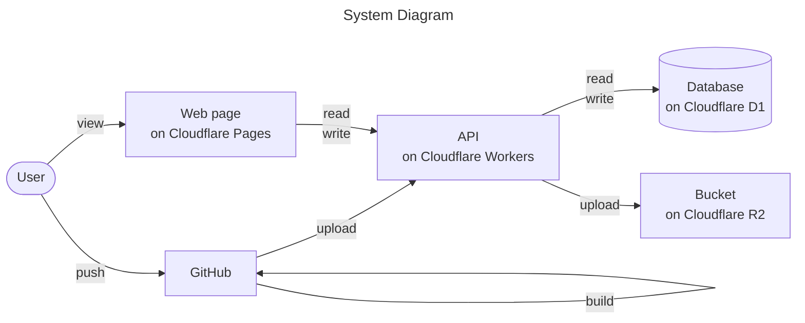

# build-cabinet

## System Diagram (Plan)

```mermaid
---
title: System Diagram
---
flowchart LR

User([User])
GitHub[GitHub]
API[API
    on Cloudflare Workers]
WebPage[Web page
    on Cloudflare Pages]
Database[(Database
    on Cloudflare D1)]
Bucket[Bucket
    on Cloudflare R2]

User -->|view| WebPage
User -->|push| GitHub
GitHub -->|build| GitHub
GitHub -->|upload| API
WebPage -->|read
    write| API
API -->|read
    write| Database
API -->|upload| Bucket
```
